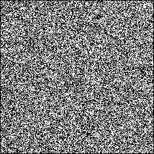

# Automaton

A Haskell library for easily defining cellular automata.

 - Quite fast
 - Some helpful functions to generate a random grid, apply game-of-life rules, and more
 - Simple to define a new rule

<center></center>

To run an example, clone the repository and install [gifgen](https://github.com/lukechilds/gifgen), then run:

```
cabal exec bash # or zsh, or whatever
rm -r out/*     # only if you've run this already
ghc -O2 gol.hs
./gol           # might take a while. i should probably do some parallel stuff
gifgen -o out.gif -f 25 out/%d.png
```

Or, if you can't be bothered to install gifgen, you could generate a gif with `ffmpeg` or some other tool, or just look at the contents of `out/` yourself. You can try framerates other than 25fps, but with gifgen, it seems that if you set it higher than that, it skips frames when playing it back, which is not ideal.

## Example

This is an example, to show how simple it is to make a game-of-life. Though it's a bit unfair, because game-of-life is actually defined inside the library already:

```haskell
main = do
    board <- random 256 256 (False, True)
    
    forM_ (zip [1..] $ take 1024 $ steps gol board) $ \(i, b) -> do
        img <- renderBoard (option (rgb 0 0 0) (rgb 255 255 255)) b
        savePngFile ("out/" ++ show i ++ ".png") img
        putStrLn $ "finished step " ++ show i ++ " of 1024"
```